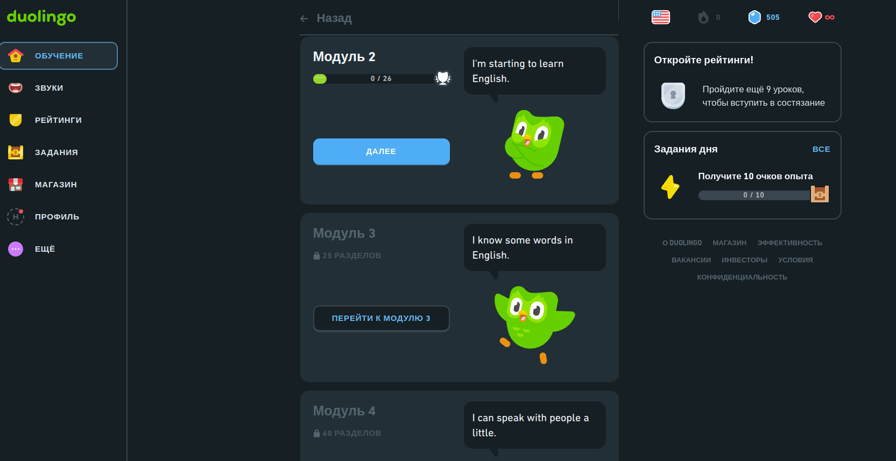
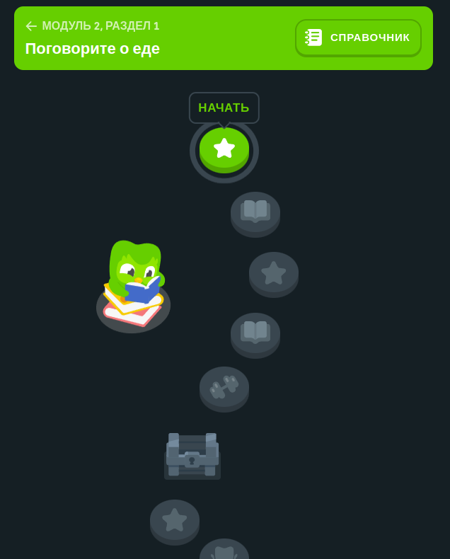
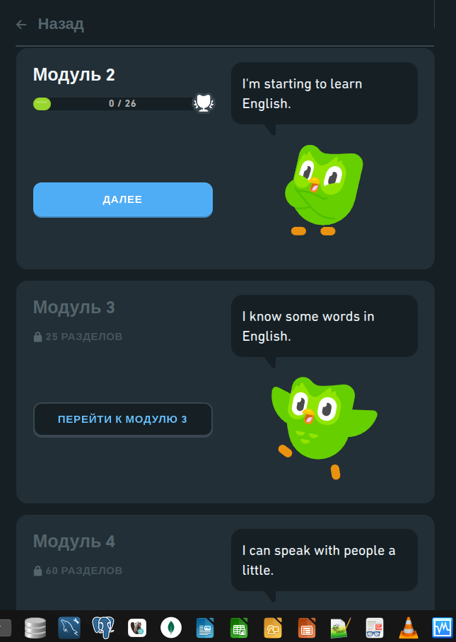

# AI

```
теперь будем создавать фронтэнд на ванильном js в серых оттенках
будет:
- главная страница (профессии с грейдами из бд)
- обучение (уровни, разделы, модули) сделай пока заглушку
- профиль (о пользователе)сделай пока заглушку

предложи структуры для этого
```

на главной (index.html) выведи профессии с описаниями и связанными грейдами.
Данный возьми из /api/v1/

Стили и разметку для главной возьми отсюда https://www.duolingo.com/
Сайт должен быть черно-белым, Логотип возмьи из файла logo_grader.png


убери все кнопки 'показать грейды' с главной
вместо них текущий рейтинг (5 прозрачных звезд, сделай пока фейковые рейтинги закраской от 0 до 5 звезд)
сделай  блок с профессией ссылкой на новую страницу profession.html
страница profession.html:
- структура похожа на главную, но вместо профессий грейды с описаниями
- под грейдами рейтинги такие же как для професссий на главной
 

 # Программа для python-бэкендера стажера 


добавь api для CRUD модулей и тем
добавь api для topics

 заполни таблицу модулями topics


создай новую страницу grade.html:
- сделай переходы  со страницы profession.html по клику на блок грейдов на страницу grade.html
- на странице grade.html  выведи название грейда и его модули
- стили и верстку для grade.html сделай чб и похожими на https://www.duolingo.com/sections






оформи grade.html как прохождения модулей в duolingo 
documentation/image-3.png
цвета серые и чб

при нажатии на активную кнопку 'в процессе' происходит переход на страницу обучения
learning.html
сделай ее похожей на https://solvit.space/baza_voprosov/python
с выводом рейтинга в процентах по каждой теме (пока фейково)


первый модуль сделай активным - активна кнопка далее
при нажатии присоходит переход на страницу learning на первую тему модуля


* создай страницу questions.html
* на ней отрисуй теоретические вопросы из таблицы theory
эндпоинты возьми из api/v1/
* со страницы learning.html сделай переход на страницу questions.html при клике на соответствующий блок


хочу сделать современный интерактивный обучающий тренажер для будущих питон-разработчиков.
предложи варианты его реализации

предложи изменения и структуру бд для 


хочу на http://127.0.0.1:8000/questions.html?topic_id=1&module_id=1&grade_id=1&profession_id=1 
отображение поля c кодом из таблицы theory (code_question) сделать с разноцветной подсветкой синтаксиса Python-кода